# A Statistically Supported DQN-Family Advantage in a Resource-Coupled Satellite-Ground Scheduling Benchmark

## 资源耦合卫星地面调度基准中具有统计支持的 DQN 家族优势

- Source: `paper/source.tex` and the current 27-page PDF
- Source format: `pdf-text`; equations verified from LaTeX

## 术语表 / Terminology ledger

| Canonical term | 中文 | 使用说明 |
|---|---|---|
| DQN family | DQN 家族 | 六种 DQN 目标 |
| DQN objective | DQN 目标 | 训练目标 |
| MPC-4 | 四步滚动时域规划器（MPC-4） | 有限时域比较器 |
| centered full-action | 中心化全动作 | 训练时辅助监督 |
| model-seed block | 模型种子区组 | 独立推断单位 |
| episode total cost | 回合总成本 | 不折扣主要指标 |

## 公式索引

- [E001](#E001)
- [E002](#E002)
- [E003](#E003)
- [E004](#E004)
- [E005](#E005)
- [E006](#E006)
- [E007](#E007)
- [E008](#E008)
- [E009](#E009)
- [E010](#E010)
- [E011](#E011)
- [E012](#E012)
- [E013](#E013)
- [E014](#E014)
- [E015](#E015)
- [E016](#E016)
- [E017](#E017)
- [E018](#E018)
- [E019](#E019)
- [E020](#E020)
- [E021](#E021)

## 正文 / Full bilingual text

**Source:** p.1 S001

**Original:** **Abstract**
Resource-coupled satellite-ground scheduling requires decisions whose computational, energy, thermal, and communication consequences persist across task arrivals. We investigated whether the deep Q-network (DQN) family shows a reproducible advantage over short-horizon planning in this temporal setting. Six DQN objectives shared identical states, network architecture, replay, optimization, interaction budgets, 20 model seeds, and held-out traces across five fully coupled regimes of a fully specified synthetic, soft-constrained benchmark. Across all 30 objective--regime comparisons, every DQN mean was lower than MPC-4, every paired 95% bootstrap interval excluded zero, and all Holm-adjusted sign tests supported the ordering. The least-favorable mean difference was -5.92, and the family-wide simultaneous 95% upper bound was -5.03. Within-family differences were smaller and scenario dependent, whereas increasing exact planning depth from one to six steps reduced cost at substantially higher decision time. Together, these results establish a DQN-family advantage that is statistically supported across objective designs and resource-stress regimes, while providing a reproducible platform for future operational validation.

**中文:** **摘要**
资源耦合的卫星地面调度需要连续作出决策，而每次决策对计算、能量、热状态和通信资源的影响会延续到后续任务到达时。本文考察在这一时间性调度场景中，深度 Q 网络（DQN）家族相对短时域规划是否具有可重复优势。六种 DQN 目标在一个定义完整的合成软约束基准中共享完全相同的状态、网络结构、经验回放、优化方法、交互预算、20 个模型种子和留出测试轨迹，并在五种完全耦合工况下评估。在全部 30 个“目标—工况”比较中，每种 DQN 的平均成本都低于 MPC-4，每个配对 95% bootstrap 区间均不包含零，且所有经 Holm 校正的符号检验均支持这一排序。最不利的均值差为 -5.92，家族整体的同时单侧 95% 上界为 -5.03。DQN 家族内部差异较小且随工况变化；与此同时，将精确规划深度从一步增加到六步虽可降低成本，却显著增加决策时间。上述结果表明，DQN 家族在不同目标设计和资源压力工况下均具有统计支持的优势，并为未来运行级验证提供了可复现平台。

**Source:** p.2 S002

**Original:** **Keywords:** deep Q-network variants; satellite edge computing; task scheduling; model-assisted reinforcement learning; full-action supervision.

**中文:** **关键词：**深度 Q 网络变体；卫星边缘计算；任务调度；模型辅助强化学习；全动作监督。

## Introduction / 引言

**Source:** p.3 S003

**Original:** Earth-observation and communication satellites increasingly execute perception and decision workloads in orbit. Compact networks can reduce downlink demand and response latency under constrained onboard resources [refs: 9925218, 10107454, 10378728, 10440355, 10423050]. However, onboard execution consumes heat, energy, and compute capacity, whereas ground offloading consumes contact time and bandwidth. Effective scheduling must therefore coordinate onboard execution, complete offloading, and collaborative preprocessing over time.

**中文:** 对地观测与通信卫星正越来越多地在轨执行感知和决策任务。在星上资源受限的条件下，轻量级网络可减少下行传输需求并缩短响应时延 [refs: 9925218, 10107454, 10378728, 10440355, 10423050]。然而，星上执行会消耗热裕度、能量和计算能力，而地面卸载则占用过站时间和带宽。因此，有效调度必须在时间维度上协调星上执行、完整卸载以及协同预处理。

**Source:** p.3 S004

**Original:** Existing schedulers optimize constellation coordination, observation plans, service placement, deadlines, makespan, or energy use [refs: RN8, RN10, RN20, RN22, RN23, RN27, RN28]. Here, every decision changes six resources that persist across task arrivals: heat, energy, queue occupancy, compute utilization, bandwidth, and remaining contact. An inexpensive action can therefore restrict the choices available for later tasks. This temporal coupling motivates a central question: can learned long-horizon values outperform transparent one-step and finite-horizon alternatives across changing resource conditions?

**中文:** 现有调度器主要优化星座协同、观测计划、服务部署、截止期、完工时间或能耗 [refs: RN8, RN10, RN20, RN22, RN23, RN27, RN28]。在本文问题中，每次决策都会改变六类会跨任务到达持续存在的资源：热状态、能量、队列占用、计算利用率、带宽和剩余过站时间。因此，当前看似成本较低的动作可能会限制后续任务的可选方案。这种时间耦合引出一个核心问题：在资源条件变化时，学习得到的长时程价值能否优于透明的一步方法和有限时域方法？

**Source:** p.3 S005

**Original:** Standard DQN [refs: mnih2015human, watkins1992q] learns one Bellman target from each factual tuple $(s_t,a_t,r_t,s_{t+1})$. In this setting, analytical resource equations can also evaluate every unexecuted action without advancing the environment or revealing later tasks. This structure enables a controlled test of both the DQN family and alternative ways to use full-action supervision during training.

**中文:** 标准 DQN [refs: mnih2015human, watkins1992q] 从每个事实元组 $(s_t,a_t,r_t,s_{t+1})$ 中学习一个 Bellman 目标。在本研究中，解析资源方程还能够评估每个未执行动作，而不会推进环境或提前暴露后续任务。该结构使我们能够受控检验 DQN 家族，以及训练阶段利用全动作监督的不同方式。

**Source:** p.3 S006

**Original:** We compare six DQN objectives: standard DQN, full-action Q, immediate advantage, centered full-action, Double DQN, and Double DQN with centered full-action supervision. A separate $gamma=0$ contextual bandit provides a learned one-step comparator. Model-evaluated alternatives are available only during training; every deployed policy acts directly from its learned Q-values.

**中文:** 我们比较六种 DQN 目标：标准 DQN、全动作 Q、即时优势、中心化全动作、Double DQN，以及带中心化全动作监督的 Double DQN。另设 $gamma=0$ 的上下文多臂老虎机作为学习型一步比较器。由模型评估的备选动作仅在训练期间可用；部署时所有策略均直接根据学习得到的 Q 值选择动作。

**Source:** p.4 S007

**Original:** We make four contributions:

- We introduce a fully specified, reproducible benchmark that links task primitives to three processing pathways and six persistent computational, energy, thermal, and communication resources.

- We construct a controlled six-objective DQN family that varies factual supervision, full-action targets, centering, bootstrapping, and Double-DQN evaluation under matched training conditions.

- We establish the family-level result directly against MPC-4 through 30 paired objective--regime contrasts, a correlation-preserving joint bootstrap, multiplicity-corrected tests, and a simultaneous upper bound.

- We provide an executable evidence chain connecting simulator equations, transition audits, trained checkpoints, seed-level inference, generated tables, validation hashes, and publication figures.

**中文:** 我们的贡献包括以下四项：

- 提出一个定义完整且可复现的基准，将任务原语与三种处理路径以及六类持续存在的计算、能量、热和通信资源相连接。

- 在匹配训练条件下构建包含六种目标的受控 DQN 家族，系统改变事实监督、全动作目标、中心化、bootstrap 以及 Double-DQN 目标评估。

- 通过 30 个配对“目标—工况”对比、保留相关性的联合 bootstrap、多重性校正检验和同时上界，直接建立 DQN 家族相对 MPC-4 的结果。

- 提供一条可执行证据链，将模拟器方程、转移审计、训练检查点、种子级推断、自动生成表格、验证哈希和发表级图形连接起来。

## Related Work and Study Positioning / 相关工作与研究定位

### Satellite-ground scheduling / 卫星地面调度

**Source:** p.4 S008

**Original:** Satellite schedulers cover constellation coordination, observation planning, service placement, and energy-aware offloading [refs: RN8, RN10, RN20, RN22, RN23, RN27, RN28]. Our setting combines an explicit cost for every action with resource carryover between task arrivals. The one-step objective is therefore observed rather than hidden. The benchmark asks whether a learned value function can exploit consequences that persist beyond this observed one-step cost.

**中文:** 卫星调度研究涵盖星座协同、观测规划、服务部署和能量感知卸载 [refs: RN8, RN10, RN20, RN22, RN23, RN27, RN28]。本文场景为每个动作赋予显式成本，并使资源状态在相邻任务到达之间延续，因此一步目标是可观测的而非隐藏的。该基准考察学习得到的价值函数能否利用超出这一可观测一步成本而持续存在的后果。

### Model use and full-action learning / 模型使用与全动作学习

**Source:** p.4 S009

**Original:** Dyna established predicted experience for value learning and planning [refs: sutton1991dyna], and fitted dynamics can accelerate deep Q-learning [refs: gu2016continuous]. Counterfactual data fusion and causal augmentation construct transitions under structural assumptions [refs: forney2017counterfactual, armengol2024caiac]. Counterfactual credit assignment instead separates action influence from future randomness [refs: mesnard2021counterfactual]. Recent work also studies multi-action generative interfaces and joint quantities across action outcomes [refs: kaya2026joint]. Together, these studies establish several routes for incorporating modeled alternatives into reinforcement learning.

**中文:** Dyna 奠定了利用预测经验进行价值学习和规划的框架 [refs: sutton1991dyna]，拟合动力学也可加速深度 Q 学习 [refs: gu2016continuous]。反事实数据融合和因果增强在结构假设下构造转移 [refs: forney2017counterfactual, armengol2024caiac]；反事实信用分配则将动作影响与未来随机性分离 [refs: mesnard2021counterfactual]。近期研究还考察多动作生成接口以及跨动作结果的联合量 [refs: kaya2026joint]。这些工作共同给出了将模型化备选结果纳入强化学习的多条路径。

**Source:** p.4 S010

**Original:** Advantage learning widens action gaps through modified operators [refs: bellemare2016gap]. Four objectives in the evaluated DQN family instead retain their respective Bellman target rules while adding training-time supervision from modeled outcomes for all actions at a sampled state. Table positions this shared supervision interface relative to related mechanisms. Standard DQN and Double DQN serve as factual-only family controls. We evaluate DQN-family performance relative to short-horizon planning under controlled conditions and characterize how target construction, centering, and target evaluation affect within-family variation.

**中文:** 优势学习通过修改算子扩大动作间隔 [refs: bellemare2016gap]。本文评估的 DQN 家族中有四种目标保留各自的 Bellman 目标规则，同时利用采样状态下全部动作的模型化结果增加训练时监督。表 将这一共享监督接口与相关机制进行定位比较；标准 DQN 和 Double DQN 则作为仅使用事实转移的家族对照。我们在受控条件下评估 DQN 家族相对短时域规划的性能，并分析目标构造、中心化和目标评估如何影响家族内部的性能差异。

**Source:** p.4 S011

**Original:** In this manuscript, “counterfactual” denotes a model-evaluated one-step outcome for an unexecuted action under the same current task and exogenous state. It does not denote an identified causal effect from observational data.

**中文:** 本文中的“反事实”是指：在当前任务和外生状态相同的条件下，由模型评估某个未执行动作的一步结果。它不表示从观测数据中识别出的因果效应。

## System Model and Immediate-Cost Quantification / 系统模型与即时成本量化

**Source:** p.5 S012

**Original:** At task arrival $t$, a satellite selects one of three actions. Action $\alpha_s$ executes onboard and downlinks the result, whereas $\alpha_g$ downlinks the complete input for ground execution. Action $\alpha_{s&g}$ performs onboard preprocessing followed by ground execution:

**中文:** 任务在时刻 $t$ 到达时，卫星从三个动作中选择一个。动作 $\alpha_s$ 在星上执行并下传结果；$\alpha_g$ 下传完整输入，由地面执行；$\alpha_{s&g}$ 先在星上预处理，再由地面完成执行：

**Source:** p.5 E001

$$
\mathcal A=\{\alpha_s,\alpha_g,\alpha_{s\&g}\},
$$

**中文说明：** 公式与现版 LaTeX 源码一致；仅翻译上下文。

**Source:** p.5 S013

**Original:** where the subscripts denote satellite, ground, and collaborative processing, respectively.

**中文:** 其中，下标分别表示星上处理、地面处理和协同处理。

### Implemented immediate-cost model / 实现的即时成本模型

**Source:** p.5 S014

**Original:** The experiments use the dimensionless linear cost implemented by the internally consistent synthetic simulator. Let $x_k$ denote the 15 task descriptors in Table. Each descriptor is normalized as

**中文:** 实验采用内部一致的合成模拟器所实现的无量纲线性成本。令 $x_k$ 表示表 中的 15 个任务描述量。每个描述量按下式归一化：

**Source:** p.6 E002

$$
\bar x_k=\clip(x_k/s_k,0,1.5),
$$

**中文说明：** 公式与现版 LaTeX 源码一致；仅翻译上下文。

**Source:** p.6 S015

**Original:** where $s_k$ is the corresponding scale. For inherited normalized bandwidth $b$, the available return rate is $R(b)=2.2+217.8b$ Mbit s$^{-1}$. The three action latencies are

**中文:** 其中 $s_k$ 为相应尺度。对于继承的归一化带宽 $b$，可用回传速率为 $R(b)=2.2+217.8b$ Mbit s$^{-1}$。三个动作的时延为

**Source:** p.6 E003

$$
\begin{aligned}
L_s&=x_3+1000x_6/R(b),\\
L_g&=x_8+1000x_9/R(b),\\
L_{s\&g}&=1000x_{12}/4+x_{13}+1000x_{15}/R(b).
\end{aligned}
$$

**中文说明：** 公式与现版 LaTeX 源码一致；仅翻译上下文。

**Source:** p.6 S016

**Original:** The implemented immediate costs are

**中文:** 实现的即时成本为

**Source:** p.6 E004

$$
\begin{aligned}
c_s^{imm}={}&0.70\bar x_1+0.65\bar x_2+0.00045L_s+0.55\bar x_5
+0.35\bar x_6+0.35h+0.12(1-e),\\
c_g^{imm}={}&0.45\bar x_7+0.00045L_g+0.55\bar x_9
+0.35(0.28-\tau)_+,\\
c_{s\&g}^{imm}={}&0.55(\bar x_{10}+\bar x_{11})+0.55\bar x_{14}
+0.00045L_{s\&g}+0.45\bar x_{15}\\
&+0.18h+0.12q+0.18(0.22-\tau)_+.
\end{aligned}
$$

**中文说明：** 公式与现版 LaTeX 源码一致；仅翻译上下文。

**Source:** p.6 S017

**Original:** Here $h$, $e$, $q$, and $tau$ are inherited heat, remaining energy, queue occupancy, and contact duration. The weights are fixed simulator assumptions rather than fitted mission utilities. They are applied identically during training, counterfactual preview, MPC evaluation, and deployment evaluation. Automated tests reproduce Eq. from the 15 raw descriptors and compare it with all three code outputs.

**中文:** 其中 $h$、$e$、$q$ 和 $tau$ 分别为继承的热状态、剩余能量、队列占用和过站持续时间。这些权重是固定的模拟器假设，而非拟合得到的任务效用；它们在训练、反事实预览、MPC 评估和部署评估中完全一致。自动化测试根据 15 个原始描述量复现式 ，并与代码的三个动作输出逐一比较。

### Internally consistent task and communication generator / 内部一致的任务与通信生成器

**Source:** p.7 S018

**Original:** The simulator does not sample heat, workload, data volume, and latency independently. It first draws correlated latent variables $(v_t,w_t)$ with correlation parameter 0.68 and maps them through a logistic transform to raw data volume $D_tin[8,64]$ Mbit and workload $W_tin[0.25,4.0]$ GFLOP. Result and collaborative-feature volumes are

**中文:** 模拟器不会独立采样热量、工作负载、数据量和时延。它首先抽取相关参数为 0.68 的潜变量 $(v_t,w_t)$，再通过 logistic 变换映射为原始数据量 $D_tin[8,64]$ Mbit 和工作负载 $W_tin[0.25,4.0]$ GFLOP。结果数据量和协同特征数据量为

**Source:** p.7 E005

$$
D_t^{res}=r_tD_t,\quad r_t\in[0.01,0.05],\qquad
D_t^{feat}=f_tD_t,\quad f_t\in[0.08,0.30].
$$

**中文说明：** 公式与现版 LaTeX 源码一致；仅翻译上下文。

**Source:** p.7 S019

**Original:** The implementation enforces $D_t^{res}le D_t^{feat}le D_t$. A workload-dependent fraction $p_tin[0.20,0.45]$ is processed onboard in the collaborative mode. Given onboard and ground rates $R_s=4$ and $R_g=80$ GFLOP s$^{-1}$, processing time is derived as $W/R$, rather than sampled separately. Compute power rises monotonically from 4 to 20 W with workload; compute heat is 0.78 times compute energy. Transmission time is data volume divided by the effective return rate

**中文:** 实现中强制满足 $D_t^{res}le D_t^{feat}le D_t$。协同模式下，工作负载相关比例 $p_tin[0.20,0.45]$ 在星上处理。给定星上和地面处理速率 $R_s=4$ 与 $R_g=80$ GFLOP s$^{-1}$，处理时间由 $W/R$ 推导，而不是单独采样。计算功率随工作负载从 4 W 单调增加至 20 W；计算热量为计算能耗的 0.78 倍。传输时间等于数据量除以有效回传速率

**Source:** p.7 E006

$$
R_t^{link}=2.2+217.8b_t\quad\text{Mbit s}^{-1},
$$

**中文说明：** 公式与现版 LaTeX 源码一致；仅翻译上下文。

**Source:** p.7 S020

**Original:** and transmission heat is 0.55 times transmit energy. These values are engineering envelopes, not fitted flight distributions. Their scale is consistent with modern SmallSat computing-system power reported by NASA. NASA ground-network examples span 2.2 Mbit s$^{-1}$ S-band to 220 Mbit s$^{-1}$ X-band returns [refs: nasa2026avionics, nasa2026ground]. The bounded data-reduction factors represent the bandwidth-reduction role of onboard image compression, not a claim about one instrument-specific codec [refs: ccsds122]. Table states every implemented assumption.

**中文:** 传输热量为传输能耗的 0.55 倍。这些数值构成工程包络，而非拟合的飞行分布。其量级与 NASA 报告的现代小卫星计算系统功率一致。NASA 地面网络示例的回传速率从 S 波段的 2.2 Mbit s$^{-1}$ 到 X 波段的 220 Mbit s$^{-1}$ [refs: nasa2026avionics, nasa2026ground]。有界数据缩减因子体现星上图像压缩降低带宽需求的作用，而非对某一特定仪器编解码器作出主张 [refs: ccsds122]。表 列出全部实现假设。

**Source:** p.7 S021

**Original:** An automated audit generated 20,000 tasks before training. All values were finite and positive, all data-flow inequalities held, and the empirical raw-data--workload correlation was 0.660. Figure shows the resulting dependence structure. Constant-rate columns have zero variance and are therefore excluded from correlation coefficients.

**中文:** 训练前的自动审计生成了 20,000 个任务。所有数值均有限且为正，全部数据流不等式均成立，原始数据量与工作负载的经验相关系数为 0.660。图 展示所得依赖结构。固定速率列的方差为零，因此不纳入相关系数计算。

### Complete stochastic generator and action-load specification / 完整随机生成器与动作负载规范

**Source:** p.7 S022

**Original:** For independent reconstruction, this subsection states the remaining simulator functions that enter the transition. Let $u_D,\epsilon_Wsimmathcal N(0,1)$ independently, $u_W=0.68u_D+1-0.68^2\epsilon_W$, and $g(u)=[1+exp(-1.55u)]^{-1}$. Nominal raw volume and workload are

**中文:** 为支持独立重建，本小节给出其余进入状态转移的模拟器函数。令 $u_D,\epsilon_Wsimmathcal N(0,1)$ 且相互独立，$u_W=0.68u_D+1-0.68^2\epsilon_W$，并定义 $g(u)=[1+exp(-1.55u)]^{-1}$。名义原始数据量和工作负载为

**Source:** p.8 E007

$$
D=8+56g(u_D)\ {\rm Mbit},\qquad W=0.25+3.75g(u_W)\ {\rm GFLOP}.
$$

**中文说明：** 公式与现版 LaTeX 源码一致；仅翻译上下文。

**Source:** p.8 S023

**Original:** The burst interval occupies indices $lfloor T/3rfloor$ through $lfloor T/3rfloor+max(4,lfloor T/4rfloor)-1$ and multiplies both quantities by 1.45. With independent $U_r,U_fsimmathcal U(0,1)$,

**中文:** 突发区间覆盖索引 $lfloor T/3rfloor$ 至 $lfloor T/3rfloor+max(4,lfloor T/4rfloor)-1$，并将上述两个量同时乘以 1.45。对于相互独立的 $U_r,U_fsimmathcal U(0,1)$，

**Source:** p.8 E008

$$
\begin{aligned}
r&=0.01+0.04U_r,\qquad f=0.08+0.22\clip[0.65g(u_W)+0.35U_f,0,1],\\
p&=0.20+0.25g(u_W),\qquad D^{res}=rD,\quad D^{feat}=fD,\quad W^{pre}=pW,\\
n&=\operatorname{round}\{6+43\clip[0.60g(u_W)+0.40g(u_D),0,1]\},\qquad x_5=n^2.
\end{aligned}
$$

**中文说明：** 公式与现版 LaTeX 源码一致；仅翻译上下文。

**Source:** p.8 S024

**Original:** Onboard and ground rates are 4 and 80 GFLOP s$^{-1}$, respectively. Compute power is $P_c=4+16clip(W/4.8,0,1)^{0.70}$ W, and transmit power is 6 W. Compute and transmit heat are 0.78 and 0.55 times their corresponding energy use. These definitions generate all 15 coordinates in Table.

**中文:** 星上与地面的处理速率分别为 4 和 80 GFLOP s$^{-1}$。计算功率为 $P_c=4+16clip(W/4.8,0,1)^{0.70}$ W，发射功率为 6 W。计算热量和传输热量分别是相应能耗的 0.78 倍和 0.55 倍。这些定义生成表 中的全部 15 个坐标。

**Source:** p.8 S025

**Original:** At reset, a single phase $phisimmathcal U(0,2pi)$ generates the exogenous link trace

**中文:** 环境重置时，单个相位 $phisimmathcal U(0,2pi)$ 用于生成外生链路轨迹

**Source:** p.8 E009

$$
\begin{aligned}
\bar b_t&=\clip\left\{\kappa_b[0.62+0.23\sin(2\pi t/24+\phi)+\epsilon^b_t]-I_{link},0.12,1\right\},\\
\bar\tau_t&=\clip\left\{0.55+0.35\sin(2\pi t/31+\phi/2)+\epsilon^\tau_t,0.08,1\right\},
\end{aligned}
$$

**中文说明：** 公式与现版 LaTeX 源码一致；仅翻译上下文。

**Source:** p.9 S026

**Original:** where $epsilon^b_tsimmathcal N(0,0.06^2)$, $epsilon^\tau_tsimmathcal N(0,0.04^2)$, $\kappa_b$ is the sensitivity multiplier, and $I_{link}=0.22$ only in the link-limited regime. All episode tasks and link states are drawn at reset from one seeded NumPy generator.

**中文:** 其中 $epsilon^b_tsimmathcal N(0,0.06^2)$、$epsilon^\tau_tsimmathcal N(0,0.04^2)$，$\kappa_b$ 为敏感性倍数，并且仅在链路受限工况下令 $I_{link}=0.22$。每个回合的所有任务和链路状态都在重置时由同一个带种子的 NumPy 生成器抽取。

**Source:** p.9 S027

**Original:** The normalized action loads used in Eq. are stated here in action order $(\alpha_s,\alpha_g,\alpha_{s&g})$:

**中文:** 式 使用的归一化动作负载按动作顺序 $(\alpha_s,\alpha_g,\alpha_{s&g})$ 表示为：

**Source:** p.9 E010

$$
\begin{aligned}
\widehat w&=(W,0.05W,W)/4.8,\qquad
\widehat Q=(x_1,0.20x_7,x_{10}+x_{11})/100,\\
\widehat B&=(x_6,x_9,x_{15})/76.8,\\
\Delta e&=\kappa_e\left(0.012+0.042\widehat w_1,
0.007+0.025\widehat B_2/b,
0.010+0.025\widehat w_3+0.018\widehat B_3/b\right),\\
\Delta q&=\left(0.055\widehat w_1(1+u),
0.048\widehat B_2/b,
0.030(\widehat w_3+\widehat B_3/b)\right),\\
\mu&=\left(0.030(1-u),0.035b\tau,0.032(1-0.5u)\right),\\
\ell&=(0.02,0.18\widehat B_2,0.12\widehat B_3).
\end{aligned}
$$

**中文说明：** 公式与现版 LaTeX 源码一致；仅翻译上下文。

**Source:** p.9 S028

**Original:** Here divisions by $b$ use $max(b,0.1)$. The utilization targets in Eq. are $(widehat w_1,0.10widehat B_2,0.55widehat w_3)$. Initial resources are $(h,e,q,u)=(0.22,0.88,0.12,0.18)$ except that energy-limited episodes use $e=0.62$ and thermal-stress episodes use $h=0.42$. Each episode terminates after exactly 64 executed actions; the terminal Bellman multiplier is zero. Energy and other resources remain soft-constrained clipped accounting states. In particular, $e=0$ neither masks infeasible actions nor terminates an episode. It therefore does not represent a conserved battery state, and clipping does not retain the magnitude of an energy deficit.

**中文:** 其中，除以 $b$ 时实际使用 $max(b,0.1)$。式 中的利用率目标为 $(widehat w_1,0.10widehat B_2,0.55widehat w_3)$。初始资源为 $(h,e,q,u)=(0.22,0.88,0.12,0.18)$；能量受限回合改用 $e=0.62$，热应力回合改用 $h=0.42$。每个回合在恰好执行 64 个动作后终止，终止时 Bellman 乘子为零。能量及其他资源均为经过裁剪的软约束记账状态。特别地，$e=0$ 既不会屏蔽不可行动作，也不会终止回合。因此，它不代表守恒的电池状态，裁剪也不会保留能量赤字的大小。

## Sequential Scheduling Formulation / 序贯调度建模

### State and transition / 状态与转移

**Source:** p.9 S029

**Original:** The normalized 24-dimensional state is

**中文:** 归一化的 24 维状态为

**Source:** p.9 E011

$$
s_t=[x_t,\eta_t,z_t],\qquad
\eta_t=[t/(T-1),\sin\phi,\cos\phi],\qquad
z_t=[h_t,e_t,q_t,u_t,b_t,\tau_t],
$$

**中文说明：** 公式与现版 LaTeX 源码一致；仅翻译上下文。

**Source:** p.9 S030

**Original:** where $x_tinR^{15}$ contains the task inputs defined in Table. The context vector $\eta_t$ exposes absolute episode time and the reset-level link phase that determine the time-varying task and link distributions. The remaining task and link innovations are independent draws conditional on this context. The six resource variables denote normalized heat, remaining energy, queue occupancy, compute utilization, bandwidth, and contact duration. Thus, within each fixed regime, the transition distribution is conditioned on all persistent simulator variables rather than on a hidden reset phase.

**中文:** 其中，$x_tinR^{15}$ 包含表 定义的任务输入。上下文向量 $\eta_t$ 显式给出回合绝对时间和重置时的链路相位，它们共同决定随时间变化的任务与链路分布。在该上下文条件下，其余任务与链路扰动相互独立抽取。六个资源变量分别表示归一化热状态、剩余能量、队列占用、计算利用率、带宽和过站持续时间。因此，在每个固定工况内，转移分布以所有持续存在的模拟器变量为条件，而非受隐藏的重置相位影响。

**Source:** p.9 S031

**Original:** Executing action $a_t$ changes resources before the next exogenous task arrives. The implemented transition is

**中文:** 动作 $a_t$ 在下一个外生任务到达之前改变资源状态。实现的转移为

**Source:** p.9 E012

$$
\begin{aligned}
h_{t+1}&=\clip(0.86h_t+0.17c\widehat Q_t^{(a_t)},0,1.3),\\
e_{t+1}&=\clip(e_t+0.006-c\Delta e_t^{(a_t)},0,1),\\
q_{t+1}&=\clip(q_t+c(\Delta q_t^{(a_t)}-\mu_t^{(a_t)}),0,1.3),\\
u_{t+1}&=\clip(0.68u_t+0.32c\widehat w_t^{(a_t)},0,1.2),\\
b_{t+1}&=\clip(\bar b_{t+1}-c\ell_t^{(a_t)},0.08,1),\\
\tau_{t+1}&=\clip(\bar\tau_{t+1}-0.10c\widehat B_t^{(a_t)},0.05,1).
\end{aligned}
$$

**中文说明：** 公式与现版 LaTeX 源码一致；仅翻译上下文。

**Source:** p.10 S032

**Original:** Here $widehat Q$, $widehat w$, and $widehat B$ are normalized action-specific heat, work, and data demands. The terms $Delta e$, $Delta q$, $mu$, and $ell$ are the deterministic resource-use, queue, service, and link-occupation functions defined in Eq.. Exogenous link variables $bar b$ and $bartau$ follow Eq. and are sampled before each episode. Coupling $c=0$ removes action-dependent carryover, $c=0.5$ weakens it, and $c=1$ defines full coupling.

**中文:** 其中，$widehat Q$、$widehat w$ 和 $widehat B$ 分别为动作特异的归一化热、工作量和数据需求。$Delta e$、$Delta q$、$mu$ 和 $ell$ 是式 定义的确定性资源消耗、队列、服务和链路占用函数。外生链路变量 $bar b$ 和 $bartau$ 遵循式 ，并在每个回合开始前采样。耦合系数 $c=0$ 时去除动作相关的跨步延续效应，$c=0.5$ 时减弱该效应，$c=1$ 时为完全耦合。

### Reward and standard DQN backbone / 奖励与标准 DQN 主干

**Source:** p.10 S033

**Original:** The reward is the negative immediate cost plus post-decision feasibility penalties:

**中文:** 奖励等于即时成本的相反数，再加上决策后的可行性惩罚：

**Source:** p.10 E013

$$
\begin{aligned}
r_t={}&-c_t^{imm}-c\big[12(h_{t+1}-0.78)_+ +15(0.18-e_{t+1})_+\\
&+8(q_{t+1}-0.75)_+ +10\mathbf 1_{a_t\ne\alpha_s}(0.14-\tau_t)_+\big].
\end{aligned}
$$

**中文说明：** 公式与现版 LaTeX 源码一致；仅翻译上下文。

**Source:** p.10 S034

**Original:** The DQN uses the unmodified factual target

**中文:** DQN 使用未经修改的事实目标

**Source:** p.10 E014

$$
y_t=r_t+\gamma(1-d_t)\max_{a'}Q_{\bar\theta}(s_{t+1},a'),
$$

**中文说明：** 公式与现版 LaTeX 源码一致；仅翻译上下文。

**Source:** p.10 S035

**Original:** and factual loss

**中文:** 以及事实损失

**Source:** p.10 E015

$$
L_{DQN}=\mathcal H\big(Q_\theta(s_t,a_t),y_t\big),
$$

**中文说明：** 公式与现版 LaTeX 源码一致；仅翻译上下文。

**Source:** p.10 S036

**Original:** where $mathcal H$ denotes the Huber loss. The target network both selects and evaluates the maximizing action, as required by standard DQN.

**中文:** 其中 $mathcal H$ 表示 Huber 损失。按照标准 DQN 的定义，目标网络同时选择并评估使 Q 值最大的动作。

## DQN Objective Family and Full-Action Supervision / DQN 目标家族与全动作监督

**Source:** p.10 S037

**Original:** The six-objective family shares the factual Huber loss and all implementation settings. Standard-DQN-based members use Eq., whereas Double-DQN members use online-network action selection with target-network evaluation. Standard DQN and Double DQN learn only from factual transitions. Four model-assisted objectives add a training-only auxiliary path that can supply labels for unexecuted actions. The following construction defines the shared preview interface and the centered member; the experimental design also evaluates uncentered full-action Q, immediate advantage, and the corresponding Double-DQN auxiliary objective.

**中文:** 六目标家族共享事实 Huber 损失及全部实现设置。以标准 DQN 为主干的成员使用式 ，Double-DQN 成员则以在线网络选择动作、以目标网络评估该动作。标准 DQN 和 Double DQN 仅从事实转移中学习；四种模型辅助目标另加一条仅用于训练的辅助路径，为未执行动作提供标签。以下构造定义共享预览接口和中心化成员，实验设计还评估非中心化全动作 Q、即时优势以及相应的 Double-DQN 辅助目标。

### Side-effect-free full-action preview / 无副作用的全动作预览

**Source:** p.11 S038

**Original:** For every replayed factual state, the analytical transition evaluates each $ainmathcal A$:

**中文:** 对于经验回放中的每个事实状态，解析转移对每个 $ainmathcal A$ 进行评估：

**Source:** p.11 E016

$$
(\tilde \ell_{t,a},\tilde z'_{t,a})=F_{preview}(x_t,z_t,a).
$$

**中文说明：** 公式与现版 LaTeX 源码一致；仅翻译上下文。

**Source:** p.11 S039

**Original:** Here $tilde \ell_{t,a}$ contains the immediate cost and post-decision feasibility penalty for action $a$. The preview does not advance time, mutate state, alter trajectories, or consume random numbers. Before action selection it computes only the current-task cost and six post-action resources. The factual action is then executed once, after which the next exogenous task $x_{t+1}$ is revealed and the replay tuple is completed. During a later replay update, all alternatives reuse this observed next task and exogenous link trace. The counterfactual next state therefore replaces only the six endogenous resource coordinates:

**中文:** 其中，$tilde \ell_{t,a}$ 包含动作 $a$ 的即时成本和决策后可行性惩罚。预览不会推进时间、修改状态、改变轨迹或消耗随机数。在选择动作前，它只计算当前任务的成本和动作后的六个资源状态。随后，事实动作仅执行一次；下一个外生任务 $x_{t+1}$ 被揭示，经验回放元组由此完成。在之后的回放更新中，所有备选动作复用这一已观测的下一任务与外生链路轨迹。因此，反事实下一状态只替换六个内生资源坐标：

**Source:** p.11 E017

$$
\tilde s'_{t,a}=[x_{t+1},\eta_{t+1},\tilde z'_{t,a}].
$$

**中文说明：** 公式与现版 LaTeX 源码一致；仅翻译上下文。

**Source:** p.11 S040

**Original:** Evaluation and deployment never call the preview interface.

**中文:** 评估和部署阶段从不调用预览接口。

### All-action counterfactual Bellman targets / 全动作反事实 Bellman 目标

**Source:** p.11 S041

**Original:** The simulator-exact one-step outcome yields

**中文:** 模拟器精确的一步结果给出

**Source:** p.11 E018

$$
\tilde y_{t,a}=-\tilde \ell_{t,a}+\gamma(1-d_t)
\max_{a'}Q_{\bar\theta}(\tilde s'_{t,a},a').
$$

**中文说明：** 公式与现版 LaTeX 源码一致；仅翻译上下文。

**Source:** p.11 S042

**Original:** The targets create no multi-step rollout and insert no counterfactual transition into replay. The centered full-action objective uses them only after the state-wise centering defined below.

**中文:** 这些目标不产生多步 rollout，也不向经验回放中插入反事实转移。中心化全动作目标仅在经过下文定义的状态内中心化之后使用这些目标。

### Centered advantage distillation / 中心化优势蒸馏

**Source:** p.12 S043

**Original:** Absolute targets in Eq. share a bootstrapped state-value offset. Deployment selects $arg\max_a Q(s,a)$, so a common additive offset cannot change the action. We define predicted and target centered advantages as

**中文:** 式 中的绝对目标共享一个由 bootstrap 产生的状态价值偏移。部署策略选择 $arg\max_a Q(s,a)$，因此公共加性偏移不会改变所选动作。预测的中心化优势与目标中心化优势定义为

**Source:** p.12 E019

$$
\begin{aligned}
\widehat A_{t,a}&=Q_\theta(s_t,a)-\frac{1}{|\mathcal A|}\sum_jQ_\theta(s_t,j),\\
\tilde A_{t,a}&=\tilde y_{t,a}-\frac{1}{|\mathcal A|}\sum_j\tilde y_{t,j}.
\end{aligned}
$$

**中文说明：** 公式与现版 LaTeX 源码一致；仅翻译上下文。

**Source:** p.12 S044

**Original:** The advantage and total losses are

**中文:** 优势损失与总损失为

**Source:** p.12 E020

$$
\begin{aligned}
L_{adv}&=\frac{1}{|\mathcal A|}
\sum_{a\in\mathcal A}\mathcal H(\widehat A_{t,a},\tilde A_{t,a}),\\
L_{CFA}&=L_{DQN}+\lambda L_{adv}.
\end{aligned}
$$

**中文说明：** 公式与现版 LaTeX 源码一致；仅翻译上下文。

**Source:** p.12 S045

**Original:** The factual term anchors the absolute Q scale, while $L_{adv}$ teaches all action gaps. The only added algorithmic hyperparameter is $lambda$.

**中文:** 事实项固定 Q 值的绝对尺度，而 $L_{adv}$ 学习全部动作差距。新增的唯一算法超参数是 $lambda$。

## Experimental Design and Settings / 实验设计与设置

### Design principles / 设计原则

**Source:** p.12 S046

**Original:** The design separates primary family-level inference from secondary within-family analysis. The primary comparison evaluates all six DQN objectives against MPC-4 across the five fully coupled regimes, yielding 30 objective--regime contrasts under shared seed blocks and traces. Secondary comparisons examine how auxiliary supervision and Double-DQN target evaluation alter performance within the family. Standard DQN versus its centered full-action variant measures the effect of adding that auxiliary objective to an unchanged factual DQN backbone. Uncentered full-action Q and centered immediate-cost targets receive the same three modeled outcomes per state. They match the type and count of model outputs. However, they do not by themselves isolate centering or Bellman bootstrapping because their target scales differ and their auxiliary weights were not tuned separately. Double DQN with and without centered full-action supervision assesses whether the fixed auxiliary implementation has a similar descriptive effect when action selection and target evaluation are decoupled [refs: vanhasselt2016double]. The $cin\{0,0.5,1\}$ regimes and planners with $Hin\{1,2,4,6\}$ bound the family comparison as the implemented objective and planning depth change.

**中文:** 实验设计将主要的家族级推断与次级的家族内部分析分开。主要比较在五种完全耦合工况下评估全部六种 DQN 目标相对 MPC-4 的表现，在共享种子区组和轨迹下形成 30 个“目标—工况”对比。次级比较考察辅助监督和 Double-DQN 目标评估如何改变家族内部表现。标准 DQN 与其中心化全动作变体的比较用于衡量在事实 DQN 主干不变时加入该辅助目标的影响。非中心化全动作 Q 和中心化即时成本目标在每个状态下接收相同的三个模型化结果，模型输出的类型和数量也相同；但由于目标尺度不同且辅助权重未分别调参，它们本身不能单独识别中心化或 Bellman bootstrap 的作用。带或不带中心化全动作监督的 Double DQN 用于考察：当动作选择与目标评估解耦时，固定辅助实现是否具有相似的描述性影响 [refs: vanhasselt2016double]。$cin\{0,0.5,1\}$ 的工况和 $Hin\{1,2,4,6\}$ 的规划器则界定了随着所实现目标与规划深度变化的家族比较边界。

**Source:** p.12 S047

**Original:** Standard DQN and its centered full-action variant share every component except the auxiliary objective. They use the same input, network, replay, exploration, optimizer, update cadence, target synchronization, and gradient clipping. The full-action Q control applies the same auxiliary weight directly to the three uncentered Bellman targets. The immediate-advantage control centers the negative analytical one-step costs but omits their bootstrapped future values. Both Double-DQN variants use online-network action selection with target-network evaluation in factual and auxiliary Bellman targets. Dueling networks, prioritized replay, multi-step returns, noisy networks, and distributional value learning remain outside the comparison.

**中文:** 标准 DQN 与其中心化全动作变体除辅助目标外共享全部组件，包括输入、网络、经验回放、探索策略、优化器、更新节奏、目标网络同步和梯度裁剪。全动作 Q 对照将相同辅助权重直接施加于三个未中心化的 Bellman 目标。即时优势对照对解析一步成本的相反数进行中心化，但不包含 bootstrap 的未来价值。两个 Double-DQN 变体在事实和辅助 Bellman 目标中均由在线网络选择动作、目标网络评估动作。Dueling 网络、优先经验回放、多步回报、噪声网络和分布式价值学习不在本次比较范围内。

**Source:** p.12 S048

**Original:** The auxiliary weight was fixed before the internally consistent simulator experiment. A preceding calibration with model seeds 700--703 compared $lambdain\{0.1,0.3,1,3\}$. It selected $lambda=0.3$ by maximizing the worst relative improvement of the centered full-action variant across five coupled regimes, with the smaller weight as the tie-break. This selection rule was specific to the centered objective. The uncentered full-action, immediate-advantage, and Double-DQN auxiliary variants inherited $lambda=0.3$ without method-specific calibration. Because auxiliary losses differ in scale and error structure, their comparisons are fixed-coefficient implementation comparisons rather than a factorial identification of centering or bootstrapping. The calibration used an earlier simulator version and is a prior specification rather than evidence from the current generator. Confirmation and all component comparisons use seeds 800--819 without post hoc removal, replacement, or selection. Every learned policy was trained only on the nominal $c=1$ distribution.

**中文:** 辅助权重在内部一致模拟器实验之前即被固定。先前使用模型种子 700--703 比较了 $lambdain\{0.1,0.3,1,3\}$，通过最大化中心化全动作变体在五种耦合工况下的最差相对改进来选择 $lambda=0.3$，并在并列时优先选择较小权重。该规则仅针对中心化目标。非中心化全动作、即时优势和 Double-DQN 辅助变体未经各自校准，直接继承 $lambda=0.3$。由于辅助损失的尺度和误差结构不同，这些比较是固定系数下的实现比较，而不是对中心化或 bootstrap 的析因识别。校准使用较早版本的模拟器，属于事先设定，不构成当前生成器的证据。确认实验及全部组件比较均使用种子 800--819，不进行事后删除、替换或筛选。所有学习策略仅在名义 $c=1$ 分布上训练。

### Training configuration / 训练配置

**Source:** p.13 S049

**Original:** Each network has 24 inputs, hidden widths 128--128--64, ReLU activations, and three outputs. Every model receives 600 episodes of 64 tasks, totaling 38,400 real interactions. Fixed settings are $gamma=0.97$, learning rate $3\times10^{-4}$, batch size 128, replay capacity 100,000, and gradient-norm limit 10. Training begins after 128 transitions and performs one update every four interactions. The checkpoint field `target_interval=250` is evaluated only on update calls; because updates occur at interaction counts divisible by four, synchronization occurs every 500 real interactions, equivalent to 125 optimizer updates. Epsilon decreases linearly from 1 to 0.05 over 13,440 interactions.

**中文:** 每个网络包含 24 个输入，隐藏层宽度为 128--128--64，采用 ReLU 激活，并输出三个动作值。每个模型训练 600 个回合，每回合 64 个任务，共计 38,400 次真实交互。固定设置为 $gamma=0.97$、学习率 $3\times10^{-4}$、批量大小 128、经验回放容量 100,000、梯度范数上限 10。累积 128 个转移后开始训练，每四次交互更新一次。检查点字段 `target_interval=250` 仅在更新调用时判断；由于更新发生在可被四整除的交互计数上，实际每 500 次真实交互同步一次，相当于 125 次优化器更新。Epsilon 在 13,440 次交互内从 1 线性下降至 0.05。

**Source:** p.13 S050

**Original:** The contextual bandit uses the same network, optimizer, exploration schedule, and interaction budget, with $gamma=0$. It therefore learns the modeled one-step reward without a long-horizon Bellman term. Uniform replay stores only one-step factual transitions, with preview outputs attached as auxiliary training data. Standard DQN and Double DQN use no analytical alternative-action labels. The four auxiliary variants evaluate three modeled outcomes at every real interaction. The checkpoint manifest records these counts, optimizer updates, and wall time for every trained model.

**中文:** 上下文多臂老虎机使用相同的网络、优化器、探索计划和交互预算，但令 $gamma=0$，因此只学习模型化的一步奖励，不含长时程 Bellman 项。均匀经验回放仅存储一步事实转移，预览输出作为辅助训练数据附加其中。标准 DQN 和 Double DQN 不使用解析备选动作标签；四个辅助变体在每次真实交互中评估三个模型化结果。检查点清单记录每个训练模型的这些计数、优化器更新次数和墙钟时间。

**Source:** p.13 S051

**Original:** All reported experiments use the internally consistent synthetic generator described above. Link bandwidth and contact follow bounded noisy periodic traces generated at reset. Burst and thermal-stress episodes multiply raw data and workload by 1.45 during one contiguous interval; all dependent heat, energy, latency, and transmission quantities are recomputed from those primitives. An earlier independently sampled generator is retained only as a historical reproducibility mode and is not used for the reported results.

**中文:** 所有报告实验均使用上述内部一致的合成生成器。链路带宽和过站时间遵循重置时生成的有界含噪周期轨迹。在突发和热应力回合中，原始数据量与工作负载在一个连续区间内乘以 1.45；全部相关热、能量、时延和传输量都由这些原语重新计算。较早的独立采样生成器仅作为历史复现模式保留，不用于本文结果。

### Seven evaluation regimes / 七种评估工况

**Source:** p.13 S052

**Original:** The seven regimes include two composite coupling-boundary conditions and five fully coupled operating conditions:

- **Static ($c=0$):** removes action-dependent state transitions and scales delayed feasibility penalties to zero.

- **Reduced coupling ($c=0.5$):** halves action-dependent resource effects and the delayed feasibility-penalty scale.

- **Nominal ($c=1$):** matches the fully coupled training distribution.

- **Burst:** increases contiguous compute and thermal demand.

- **Link-limited:** reduces the available bandwidth trace by 0.22 before clipping.

- **Energy-limited:** lowers initial energy from 0.88 to 0.62.

- **Thermal-stress:** raises initial heat from 0.22 to 0.42 and includes the burst interval.

**中文:** 七种工况包括两个复合耦合边界条件和五个完全耦合运行条件：

- **静态（$c=0$）：**去除动作相关状态转移，并将延迟可行性惩罚缩放为零。

- **弱耦合（$c=0.5$）：**将动作相关资源影响和延迟可行性惩罚尺度减半。

- **名义（$c=1$）：**与完全耦合的训练分布一致。

- **突发：**提高连续区间内的计算与热需求。

- **链路受限：**在裁剪前将可用带宽轨迹降低 0.22。

- **能量受限：**将初始能量从 0.88 降至 0.62。

- **热应力：**将初始热状态从 0.22 提高至 0.42，并包含突发区间。

**Source:** p.13 S053

**Original:** The first two regimes are composite interventions because the same $c$ appears in both the transition in Eq. and the delayed-penalty term in Eq.. They therefore do not isolate action-dependent carryover from reward rescaling. The remaining five regimes retain $c=1$. Models trained at $c=1$ are transferred to the two boundary conditions without retraining. These rows measure behavior under a joint objective-and-dynamics shift rather than the best policy attainable at lower coupling.

**中文:** 前两种工况属于复合干预，因为同一 $c$ 同时出现在式 的状态转移和式 的延迟惩罚项中。因此，它们不能将动作相关跨步延续效应与奖励缩放分离。其余五种工况均保持 $c=1$。在 $c=1$ 下训练的模型不经重新训练，直接迁移至两个边界条件。这两行衡量目标与动力学同时变化时的行为，而不是较低耦合下可达到的最优策略。

### Planning comparator, outcomes, and inference / 规划比较器、评价指标与统计推断

**Source:** p.14 S054

**Original:** The deployment comparison includes immediate-cost argmin, a contextual bandit, a prespecified resource-threshold heuristic, standard DQN, the centered full-action family member, and an exact $H$-step receding-horizon model-based planner. The threshold rule selects ground processing when $h>0.72$ or $e<0.24$ and both $b>0.28$ and $tau>0.18$; under the same heat or energy condition it otherwise selects collaborative processing. If that condition is absent, it selects onboard processing when $b<0.22$ or $tau<0.14$, collaborative processing when $q>0.70$, and immediate-cost argmin otherwise. These thresholds were hand specified and not fitted to the evaluation traces. Fixed onboard and fixed ground policies always select $\alpha_s$ and $\alpha_g$, respectively.

**中文:** 部署比较包括即时成本最小策略、上下文多臂老虎机、预设资源阈值启发式、标准 DQN、中心化全动作这一 DQN 家族成员，以及精确的 $H$ 步滚动时域模型规划器。阈值规则在 $h>0.72$ 或 $e<0.24$ 且同时满足 $b>0.28$ 与 $tau>0.18$ 时选择地面处理；在相同热或能量条件下，若后两个条件不满足，则选择协同处理。若不存在上述热或能量条件，则在 $b<0.22$ 或 $tau<0.14$ 时选择星上处理，在 $q>0.70$ 时选择协同处理，其他情况下选择即时成本最小动作。这些阈值由人工预设，未对评估轨迹拟合。固定星上和固定地面策略分别始终选择 $\alpha_s$ 和 $\alpha_g$。

**Source:** p.14 S055

**Original:** At every real decision, the planner enumerates all $3^H$ action sequences over the next $H$ known tasks and link states. It minimizes discounted modeled cost with $gamma=0.97$, executes only the first action, and replans. The primary table retains $H=4$. A separate nominal analysis evaluates $Hin\{1,2,4,6\}$ on 400 unique held-out traces and reports wall-clock cost per decision. Each planner is exact only for its stated perfect-forecast objective, not for the 64-step global problem.

**中文:** 在每个真实决策时刻，规划器针对未来 $H$ 个已知任务和链路状态枚举全部 $3^H$ 个动作序列，以 $gamma=0.97$ 最小化折扣模型成本，仅执行第一个动作，随后重新规划。主表保留 $H=4$。另一个名义分析在 400 条互不重复的留出轨迹上评估 $Hin\{1,2,4,6\}$，并报告每次决策的墙钟耗时。每个规划器仅对其所声明的完美预测有限时域目标是精确的，而不是 64 步全局问题的精确解。

**Source:** p.14 S056

**Original:** The primary outcome is the undiscounted episode total cost

**中文:** 主要评价指标为不折扣的回合总成本

**Source:** p.14 E021

$$
C_{\mathrm{episode}}=\sum_{t=0}^{T-1}\left(c^{\mathrm{imm}}_t+p_t\right)=-\sum_{t=0}^{T-1}r_t,
$$

**中文说明：** 公式与现版 LaTeX 源码一致；仅翻译上下文。

**Source:** p.14 S057

**Original:** where $p_t$ is the complete nonnegative penalty inside the square brackets in Eq., including its multiplier $c$. Every executed step, including the terminal step, contributes once. DQN and the finite-horizon planner optimize discounted targets with $gamma=0.97$, whereas Eq. reports accumulated operational cost without discounting. This optimization--evaluation distinction was not subjected to a separate discount sensitivity analysis. Secondary outcomes are immediate cost, delayed penalty, energy use, modeled latency, transmitted data, threshold-exposure steps, planner wall-clock time, maximum heat, and minimum remaining energy.

**中文:** 其中，$p_t$ 是式 方括号内包含乘子 $c$ 的完整非负惩罚。每个已执行步骤（包括终止步）均计入一次。DQN 与有限时域规划器使用 $gamma=0.97$ 优化折扣目标，而式 报告不折扣的累积运行成本。该优化与评估目标的区别未单独进行折扣敏感性分析。次要指标包括即时成本、延迟惩罚、能量使用、模型时延、传输数据量、阈值暴露步数、规划器墙钟时间、最高热状态和最低剩余能量。

**Source:** p.15 S058

**Original:** The independent inferential unit is the model-seed block. For learned--learned comparisons, the same seed initializes network weights and controls episode task seeds, exploration draws, and replay-index sampling. Trajectories may diverge after different greedy actions, but the matched seed remains the randomization block. Each seed is evaluated on the same 20 held-out traces, which are averaged within seed, giving $n=20$ blocks per learned method. For the central DQN-family--MPC-4 claim, every raw row is matched on regime, model-seed trace namespace, and trace seed before trace-level differences are averaged within seed. MPC-4 is deterministic conditional on a trace; the model-seed field therefore indexes its matched trace namespace rather than a trained planner replicate.

**中文:** 独立推断单位是模型种子区组。对于学习方法之间的比较，相同种子用于初始化网络权重，并控制回合任务种子、探索抽样和回放索引采样。不同贪婪动作可能使轨迹分化，但匹配种子仍作为随机化区组。每个种子在相同的 20 条留出轨迹上评估，并先在种子内取平均，因此每种学习方法有 $n=20$ 个区组。对于核心的 DQN 家族与 MPC-4 比较，每一原始行先按工况、模型种子轨迹命名空间和轨迹种子匹配，再在种子内对轨迹级差值取平均。给定轨迹后 MPC-4 是确定性的，因此其模型种子字段索引的是匹配的轨迹命名空间，而非训练得到的规划器重复。

**Source:** p.15 S059

**Original:** All paired bootstrap analyses use 10,000 resamples with seed 20260829. Individual two-sided 95% intervals are percentile intervals, and exact two-sided paired sign tests assess directional consistency. For the 30 DQN-objective--regime contrasts against MPC-4, one joint bootstrap resamples the same 20 seed blocks across all contrasts, preserving their correlation. Sign-test values are Holm-adjusted across all 30 cells. We additionally report the maximum, least-favorable mean difference within each regime and across all 30 cells. A simultaneous one-sided 95% upper bound adds a joint critical value to every observed cell mean. The critical value is the 95th percentile of the largest centered bootstrap deviation across the relevant cells. An upper bound below zero supports the joint statement that every mean difference is negative.

**中文:** 全部配对 bootstrap 分析均使用随机种子 20260829 进行 10,000 次重采样。单个双侧 95% 区间采用百分位区间，精确双侧配对符号检验评估方向一致性。对于 DQN 各目标相对 MPC-4 的 30 个“目标—工况”对比，一次联合 bootstrap 在所有对比中同步重采样相同的 20 个种子区组，从而保留其相关性。符号检验值在全部 30 个单元格上进行 Holm 校正。我们还报告每种工况内以及全部 30 个单元格中的最大、即最不利均值差。同时单侧 95% 上界是在每个观测单元均值上加一个联合临界值；该临界值为相关单元格中最大中心化 bootstrap 偏差的第 95 百分位数。若上界低于零，则支持所有均值差均为负的联合陈述。

**Source:** p.15 S060

**Original:** For within-family contrasts, Holm adjustment is applied across the five fully coupled regimes separately for each prespecified contrast. The eight parameter profiles form a separate family, and each preview-scale contrast forms its own five-regime family. A directional cell is labelled supported only when its mean favors the first-named method, its paired interval excludes zero, and its family-adjusted sign-test value is below 0.05. We report seed-level differences and leave-one-seed-out ranges for the prespecified centered full-action versus standard-DQN contrast. Its conservative sensitivity analysis resamples the two sets of 20 seed means independently and ignores matching. Test traces and bootstrap draws are never treated as independent model replicates.

**中文:** 对于家族内部对比，每个预设对比分别在五种完全耦合工况上进行 Holm 校正。八个参数配置构成一个独立检验族，每个预览尺度对比各自构成包含五种工况的检验族。只有当均值有利于先列方法、配对区间不含零且家族校正后的符号检验值低于 0.05 时，方向性单元格才标记为“支持”。对于预设的中心化全动作与标准 DQN 对比，我们报告种子级差值和留一模型种子均值范围。其保守敏感性分析分别独立重采样两组各 20 个种子均值，不利用配对。测试轨迹和 bootstrap 抽样从不作为独立模型重复。

### Prespecified sensitivity and training diagnostics / 预设敏感性与训练诊断

**Source:** p.15 S061

**Original:** Without retraining or model selection, we repeated the nominal evaluation under eight profiles. They covered the reference configuration, compute demand $\pm20%$, raw data volume $\pm20%$, energy use $+20%$, heat load $+20%$, and link capacity $-20%$. Each profile retained the same 20 models and the same held-out trace namespace as the primary experiment, with Holm adjustment across the eight profiles. Training logs record every episode for all 20 seeds. Curves report a causal 25-episode moving mean and seed-level mean $pm$ SD for total cost, energy use, latency, and delayed penalty. These diagnostics describe optimization trajectories; confirmation claims remain based on held-out traces.

**中文:** 在不重新训练或选择模型的情况下，我们在八种配置下重复名义评估，包括参考配置、计算需求 $\pm20%$、原始数据量 $\pm20%$、能量使用 $+20%$、热负载 $+20%$ 和链路容量 $-20%$。每种配置保留与主实验相同的 20 个模型及留出轨迹命名空间，并在八种配置上进行 Holm 校正。训练日志记录全部 20 个种子的每个回合。总成本、能量使用、时延和延迟惩罚曲线报告因果的 25 回合移动均值以及种子级均值 $pm$ 标准差。这些诊断描述优化轨迹；确认性主张仍以留出轨迹为依据。

### Preview-model misspecification test / 预览模型误设检验

**Source:** p.15 S062

**Original:** The main experiment assumes that the analytical preview matches the simulator transition. To test this dependence, two additional centered full-action model sets were trained without changing the factual environment or deployment evaluation. One set scaled preview one-step costs (immediate cost plus modeled penalty) and action-induced resource changes by 0.85, while the other used 1.15. Resource predictions were clipped to the same physical bounds after scaling around the current resource state. Each condition used the same 20 seeds, training budget, network, replay, and held-out trace namespace as the main experiment. These scales were fixed as symmetric stress tests and were not used for model selection.

**中文:** 主实验假设解析预览与模拟器转移一致。为检验对该假设的依赖，在不改变事实环境或部署评估的情况下，另外训练两组中心化全动作模型。一组将预览的一步成本（即时成本加模型化惩罚）和动作引起的资源变化按 0.85 缩放，另一组按 1.15 缩放。以当前资源状态为中心完成缩放后，资源预测仍裁剪到相同物理边界。每个条件均使用与主实验相同的 20 个种子、训练预算、网络、经验回放和留出轨迹命名空间。这两个尺度作为对称压力检验预先固定，不用于模型选择。

### Reproducible result entry point / 可复现结果入口

**Source:** p.16 S063

**Original:** The core result entry point is python -m dqn\_ family\_ satellite\_ ground. reviewer\_ experiments all --seeds 800-819 --resume. Component and Double-DQN comparisons use python -m dqn\_ family\_ satellite\_ ground. extended\_ revision --seeds 800-819 --stage all --resume. The first command trains or loads 60 primary learned-policy checkpoints plus 40 preview-error checkpoints. The second reuses the primary DQN checkpoints and trains 80 component and Double-DQN checkpoints. It then evaluates six DQN objectives, performs the independent-seed bootstrap, and evaluates four planning depths on 400 unique traces.

**中文:** 核心结果入口为 python -m dqn\_ family\_ satellite\_ ground. reviewer\_ experiments all --seeds 800-819 --resume。组件与 Double-DQN 比较使用 python -m dqn\_ family\_ satellite\_ ground. extended\_ revision --seeds 800-819 --stage all --resume。第一条命令训练或加载 60 个主要学习策略检查点以及 40 个预览误差检查点。第二条命令复用主要 DQN 检查点，并训练 80 个组件与 Double-DQN 检查点；随后评估六种 DQN 目标，执行独立种子 bootstrap，并在 400 条互不重复的轨迹上评估四种规划深度。

**Source:** p.16 S064

**Original:** The command python -m dqn\_ family\_ satellite\_ ground. extended\_ reporting recomputes the 30 paired DQN--MPC-4 contrasts, joint maximum statistics, LaTeX tables, and artifact hashes from locked raw CSV files. The command python -m dqn\_ family\_ satellite\_ ground. transition\_ audit writes a fixed-seed, all-action example in which preview and executed costs and six resources agree coordinate by coordinate. Unit tests repeat this equality at both resource clipping boundaries and on the terminal step, and verify that time and link phase occupy the three added state coordinates.

**中文:** 命令 python -m dqn\_ family\_ satellite\_ ground. extended\_ reporting 从锁定的原始 CSV 文件重新计算 30 个配对 DQN--MPC-4 对比、联合最大统计量、LaTeX 表格和制品哈希。命令 python -m dqn\_ family\_ satellite\_ ground. transition\_ audit 写出一个固定种子的全动作示例，其中预览成本、执行成本及六个资源坐标逐项一致。单元测试在两个资源裁剪边界和终止步重复验证这一相等性，并确认时间与链路相位占据新增的三个状态坐标。

**Source:** p.16 S065

**Original:** Experiments used Python 3.13.9, NumPy 2.4.1, pandas 3.0.3, and PyTorch 2.8.0 with CUDA 12.9. Hardware comprised an NVIDIA GeForce RTX 5070 Ti running Windows 11. Planning wall time was measured on a 12th Gen Intel Core i9-12900K with 24 logical processors after one untimed warm-up episode. Values report the mean over all timed decisions. Machine-readable metadata record the 24-dimensional state definition, resolved variants, seeds, budgets, randomization blocks, model-information counts, result files, and runtime environment. Table and figure scripts consume these files directly.

**中文:** 实验使用 Python 3.13.9、NumPy 2.4.1、pandas 3.0.3，以及配套 CUDA 12.9 的 PyTorch 2.8.0。硬件为运行 Windows 11 的 NVIDIA GeForce RTX 5070 Ti。规划墙钟时间在配备 24 个逻辑处理器的第 12 代 Intel Core i9-12900K 上测量，并先运行一个不计时的预热回合；报告值为全部计时决策的均值。机器可读元数据记录 24 维状态定义、解析后的变体、种子、预算、随机化区组、模型信息计数、结果文件和运行环境。表格与图形脚本直接读取这些文件。

## Results / 结果

### Direct paired inference establishes a DQN-family advantage under full coupling / 直接配对推断确立完全耦合条件下的 DQN 家族优势

**Source:** p.16 S066

**Original:** We first tested the family-level claim against the strongest implemented non-DQN comparator. MPC-4 had the lowest non-DQN mean in every fully coupled regime. All 30 paired objective--regime comparisons favored DQN, and every individual 95% bootstrap interval excluded zero.

**中文:** 我们首先用已实现的最强非 DQN 比较器检验家族级主张。在每种完全耦合工况中，MPC-4 都具有最低的非 DQN 均值。全部 30 个配对“目标—工况”比较均有利于 DQN，且每个单独的 95% bootstrap 区间均不包含零。

**Source:** p.17 S067

**Original:** The joint seed-block analysis supported the same conclusion after controlling multiplicity across all 30 cells. Every seed block favored DQN, and the largest Holm-adjusted sign-test value was 5.722e-05. The least-favorable cell was Double DQN under energy limitation, with a mean difference of -5.92 and a simultaneous 95% upper bound of -5.03 (Table; Fig.). Nominal DQN-family means spanned 77.66--78.40, compared with 90.83 for MPC-4. This direct inference establishes the DQN-family advantage as the central benchmark finding.

**中文:** 在控制全部 30 个单元格的多重性后，联合种子区组分析支持相同结论。每个种子区组均有利于 DQN，最大的 Holm 校正符号检验值为 5.722e-05。最不利单元格是能量受限条件下的 Double DQN，其均值差为 -5.92，同时单侧 95% 上界为 -5.03（表 ；图 ）。名义工况下 DQN 家族均值范围为 77.66--78.40，而 MPC-4 为 90.83。这一直接推断确立了 DQN 家族优势是该基准的核心发现。

### Target design fine-tunes performance within a consistently strong DQN family / 目标设计在整体强势的 DQN 家族内部微调性能

**Source:** p.18 S068

**Original:** Across the five fully coupled regimes, the six objectives occupied a narrow performance band (Table; Fig.). Nominal means ranged from 77.66 to 78.40. The leading objective varied by regime, and the family-to-MPC gap exceeded the differences among target designs.

**中文:** 在五种完全耦合工况下，六种目标处于较窄的性能区间内（表 ；图 ）。名义均值范围为 77.66 至 78.40。领先目标随工况变化，且 DQN 家族与 MPC 的差距大于不同目标设计之间的差异。

**Source:** p.19 S069

**Original:** Centered full-action produced favorable mean differences against standard DQN in all five regimes and met the complete support rule in 3 (Table). The remaining component and Double-DQN contrasts changed the ordering by smaller, scenario-dependent amounts (Table). Target construction contributed smaller, scenario-dependent variation within the family. All objectives used the same real-interaction budget, while the auxiliary objectives additionally consumed modeled action outcomes (Table).

**中文:** 中心化全动作在全部五种工况下相对标准 DQN 均获得有利的均值差，并在其中 3 种工况满足完整支持规则（表 ）。其余组件与 Double-DQN 对比以较小且依赖工况的幅度改变排序（表 ）。目标构造为家族内部带来较小且依赖工况的性能差异。所有目标使用相同的真实交互预算，而辅助目标还额外消耗模型化动作结果（表 ）。

### The DQN family retains an advantage over deeper exact planning / DQN 家族相对更深层精确规划仍保持优势

**Source:** p.20 S070

**Original:** Increasing planning depth reduced nominal mean cost from 99.33 at $H=1$ to 89.35 at $H=6$. Over the same range, mean decision time increased from 0.13 to 42.50 ms. MPC-6 remained above the nominal DQN-family range of 77.66--78.40. The DQN-family advantage therefore persisted through six-step exact planning.

**中文:** 将规划深度从 $H=1$ 增至 $H=6$，名义平均成本从 99.33 降至 89.35；同期平均决策时间从 0.13 ms 增至 42.50 ms。MPC-6 的成本仍高于 DQN 家族的名义范围 77.66--78.40。因此，DQN 家族的优势持续至六步精确规划。

**Source:** p.21 S071

**Original:** Table provides a representative decomposition of the standard-DQN--MPC-4 gap. Relative to MPC-4, standard DQN reduced delayed penalties in every fully coupled regime while changing immediate cost by only $-0.57$ to $1.36$. It also used less modeled energy, latency, and transmitted data. Both methods reached zero in the clipped energy state, while standard DQN produced slightly higher maximum heat. This resource-use decomposition applies specifically to standard DQN.

**中文:** 表 给出标准 DQN 与 MPC-4 差距的一项代表性分解。相对 MPC-4，标准 DQN 在每种完全耦合工况下都降低了延迟惩罚，而即时成本仅变化 $-0.57$ 至 $1.36$；其模型化能耗、时延和传输数据量也更低。两种方法的裁剪能量状态均曾达到零，而标准 DQN 的最高热状态略高。这一资源使用分解具体适用于标准 DQN。

### Representative DQN training diagnostics show empirical stabilization / 代表性 DQN 训练诊断显示经验趋稳

**Source:** p.22 S072

**Original:** All four logged quantities declined during approximately the first 220 episodes and then fluctuated around stable ranges (Fig.). The late-episode trajectories indicate empirical stabilization for these two representative family members.

**中文:** 四个记录量均在约前 220 个回合内下降，随后围绕稳定区间波动（图 ）。后期轨迹表明这两个代表性家族成员的训练指标达到经验稳定状态。

### Within-family sensitivity under parameter changes / 参数变化下的家族内部敏感性

**Source:** p.23 S073

**Original:** The paired interval for centered full-action minus standard DQN remained below zero in all eight profiles, with relative differences from 0.50% to 1.66%. The largest difference occurred when raw data volume decreased by 20%, whereas the smallest occurred when it increased by 20%. The within-family direction therefore remained stable across the prespecified parameter envelope.

**中文:** 在全部八种配置中，中心化全动作与标准 DQN 的配对区间均保持低于零，相对差异范围为 0.50% 至 1.66%。原始数据量降低 20% 时差异最大，提高 20% 时差异最小。因此，家族内部方向在预设参数包络内保持稳定。

### Preview-scale perturbations bound one model-assisted variant / 预览尺度扰动界定一个模型辅助变体的边界

**Source:** p.24 S074

**Original:** Uniform 15% under- and over-scaling preserved favorable differences between centered full-action and standard DQN (Table). The two conditions met the complete rule in 3 and 3 regimes, respectively. Their largest Holm-adjusted sign-test values were 0.5264 and 0.2632.

**中文:** 统一下调和上调 15% 均保留了有利于中心化全动作的差值（表 ）。两个条件分别在 3 和 3 种工况下满足完整规则，其最大 Holm 校正符号检验值分别为 0.5264 和 0.2632。

## Discussion / 讨论

**Source:** p.24 S075

**Original:** Six DQN objectives retained a common advantage over MPC-4 across changes in supervision, centering, bootstrapping, and Double-DQN evaluation. Their narrow internal spread indicates that the shared sequential value-learning formulation contributed more to performance than target design.

**中文:** 六种 DQN 目标在监督方式、中心化、bootstrap 和 Double-DQN 评估变化下均保持对 MPC-4 的共同优势。较窄的家族内部差异表明，共享的序贯价值学习建模对性能的贡献大于目标设计。

**Source:** p.24 S076

**Original:** The contextual bandit comparison and planning-depth analysis support a temporal interpretation of this result. The DQN family outperformed immediate-reward learning, while deeper exact enumeration progressively narrowed the cost gap. Together, these observations are consistent with learned values capturing consequences that persist beyond the current allocation.

**中文:** 上下文多臂老虎机比较和规划深度分析支持对这一结果的时间性解释。DQN 家族优于即时奖励学习，而更深的精确枚举逐步缩小了成本差距。综合来看，这些观测与“学习得到的价值捕捉了超出当前资源分配而持续存在的后果”这一解释相一致。

**Source:** p.25 S077

**Original:** The benchmark provides a second contribution by making that comparison traceable and reusable. Shared task primitives generate heat, energy, latency, and transmitted volume, while transition audits connect the analytical previews to executed outcomes. Scripts then link checkpoints and seed-level estimates to tables, figures, and validation hashes. This evidence chain turns the scheduling problem into a reproducible platform for comparing sequential decision objectives.

**中文:** 该基准的第二项贡献是使上述比较可追溯、可复用。共享任务原语生成热量、能量、时延和传输数据量，转移审计将解析预览与实际执行结果连接起来；脚本进一步把检查点和种子级估计连接至表格、图形和验证哈希。这条证据链使该调度问题成为比较序贯决策目标的可复现平台。

### Future work / 未来工作

**Source:** p.25 S078

**Original:** The first priority is operational validation. The current simulator uses dimensionless fixed weights and clipped soft resource states, so future versions should enforce feasibility through action masking, constrained reinforcement learning, and terminal resource conditions. Mission-derived utilities, telemetry, and hardware-in-the-loop traces can then test the ordering under physical resource dynamics. Multi-satellite, multi-ground-station, and variable-contact topologies will further establish scalability.

**中文:** 首要方向是运行级验证。当前模拟器使用无量纲固定权重和经过裁剪的软资源状态，因此未来版本应通过动作屏蔽、约束强化学习和终止资源条件来强制满足可行性。随后，可使用任务来源的效用、遥测数据和硬件在环轨迹，在物理资源动力学下检验方法排序。多卫星、多地面站和可变过站拓扑还将进一步验证可扩展性。

**Source:** p.26 S079

**Original:** The second priority is causal separation of the mechanisms that produce the family-level pattern. Future experiments should tune auxiliary weights by objective, normalize gradient contributions, and factorially separate centering, Bellman bootstrapping, and discounting. Future experiments should vary transition carryover and delayed-penalty scaling independently. Regime-specific retraining will complement the current $c=1$ transfer tests. Structural, state-dependent, and action-specific preview errors, together with family-wide action-mixture analyses, can identify which components sustain the result.

**中文:** 第二个方向是对产生家族级模式的机制进行因果分离。未来实验应针对不同目标分别调整辅助权重、归一化梯度贡献，并通过析因设计分离中心化、Bellman bootstrap 和折扣的作用。未来实验应独立改变转移的跨步延续效应与延迟惩罚尺度。针对各工况重新训练可补充当前从 $c=1$ 直接迁移的检验。结构化、状态相关和动作特异的预览误差，结合家族范围的动作混合分析，有助于识别维持该结果的具体成分。

**Source:** p.26 S080

**Original:** The third priority is a broader and computationally matched comparator frontier. Scalable tree search, dynamic programming, mixed-integer optimization, and satellite-specific schedulers should be evaluated under matched information and computation budgets. DQN inference latency and energy should be measured on the same deployment path as planning. These studies will determine how the benchmark advantage transfers to operational scheduling.

**中文:** 第三个方向是构建更广泛且计算预算匹配的比较器前沿。应在匹配的信息与计算预算下评估可扩展树搜索、动态规划、混合整数优化和卫星专用调度器。DQN 的推理时延与能耗也应在与规划器相同的部署路径上测量。这些研究将确定基准中的优势如何迁移到运行调度。

## Conclusion / 结论

**Source:** p.26 S081

**Original:** We establish a statistically supported DQN-family advantage in a reproducible resource-coupled satellite-ground scheduling benchmark. All 30 paired objective--regime contrasts favored DQN over MPC-4, with a family-wide simultaneous 95% upper bound of -5.03. Smaller, scenario-dependent differences among DQN objectives reinforce the consistency of this family-level result. The benchmark now provides a rigorous foundation for the mission-calibrated, hard-constrained, and computationally matched studies defined in Future work.

**中文:** 本文在一个可复现的资源耦合卫星地面调度基准中确立了具有统计支持的 DQN 家族优势。全部 30 个配对“目标—工况”对比均有利于 DQN 而非 MPC-4，家族整体的同时单侧 95% 上界为 -5.03。DQN 各目标之间较小且依赖工况的差异进一步强化了这一家族级结果的一致性。该基准为未来工作所界定的任务标定、硬约束和计算预算匹配研究提供了严格基础。

**Source:** p.27 S082

**Original:** This work was supported by the National Key Research and Development Program of China under Grants 2022YFF0503904 and 2022YFD2401202. Additional support came from the Shenzhen Higher Education Institutions Stabilization Support Program under Grant GXWD20220811163556003. The National Natural Science Foundation of China supported this work under Grant 62202127, and the Shenzhen Natural Science Foundation under Grant JCYJ20241202123731040. Further support came from the Guangxi Science and Technology Base and Talent Special Project under Grant Gui Ke AD25069103.

**中文:** 本研究得到国家重点研发计划项目（2022YFF0503904、2022YFD2401202）资助，并得到深圳市高等院校稳定支持计划项目（GXWD20220811163556003）支持。国家自然科学基金项目（62202127）和深圳市自然科学基金项目（JCYJ20241202123731040）亦对本研究提供资助。此外，本研究还得到广西科技基地和人才专项项目（桂科 AD25069103）支持。

**Source:** p.27 S083

**Original:** The versioned reproducibility package contains the simulator, 180 trained checkpoints, training curves, locked raw evaluations, seed-level summaries, and direct DQN--MPC-4 inference. It also provides transition audits, Python and MATLAB figure-generation source, and LaTeX-table generators under `dqn_family_satellite_ground/`, together with the current manuscript PDF. The package covers the six DQN objectives, the contextual-bandit comparator, preview-error tests, parameter sensitivity, exact MPC planning-depth analysis, joint bootstrap, and maximum-statistic results reported here. No pre-rendered manuscript figures or LaTeX source files are included. Scripts write regenerated outputs to `reproduced_outputs/`. Machine-readable metadata, a manifest, and SHA-256 checksums record seeds, budgets, package versions, source files, and artifacts. The complete versioned package is publicly available at https://github.com/noob32123/dqn_family_satellite_ground.

**中文:** 版本化复现包在 `dqn_family_satellite_ground/` 下包含模拟器、180 个训练检查点、训练曲线、锁定的原始评估、种子级汇总、DQN--MPC-4 直接推断、转移审计、Python 与 MATLAB 绘图源码以及 LaTeX 表格生成器，并附当前论文 PDF。复现包覆盖本文报告的六种 DQN 目标、上下文老虎机对照、预览误差测试、参数敏感性、精确 MPC 规划深度分析、联合 bootstrap 与最大统计量结果。包内不预置论文图片或 LaTeX 源码；脚本将重新生成的输出写入 `reproduced_outputs/`。机器可读元数据、清单和 SHA-256 校验和记录种子、预算、软件包版本、源文件与制品。完整的版本化复现包已公开发布于 https://github.com/noob32123/dqn_family_satellite_ground。

## 图与表 / Figures and tables

双语 PDF 保留图表在首次实质性讨论附近的位置；以下为独立资源卡。

### F001 · DQN 家族相对 MPC-4 的联合证据

**Source:** p.2

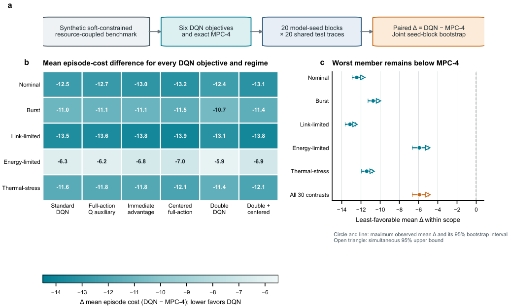

**中文图注：** DQN 家族相对 MPC-4 的联合证据。完整双语图注见 PDF。

### F002 · 三种卫星地面处理路径

**Source:** p.5

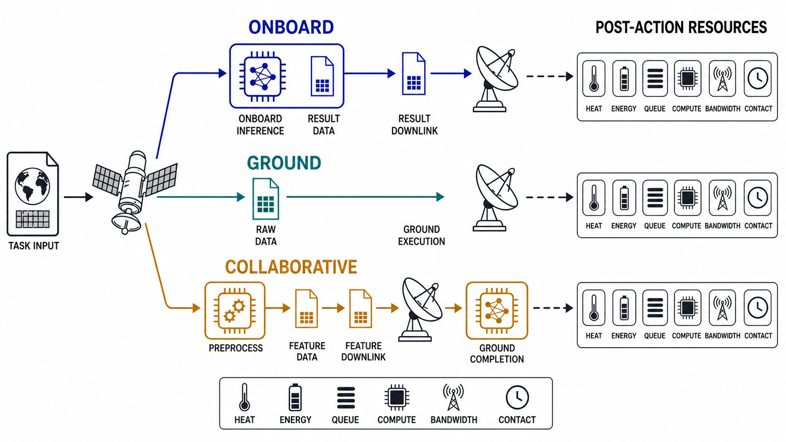

**中文图注：** 三种卫星地面处理路径。完整双语图注见 PDF。

### F003 · 合成生成器内部一致性审计

**Source:** p.7

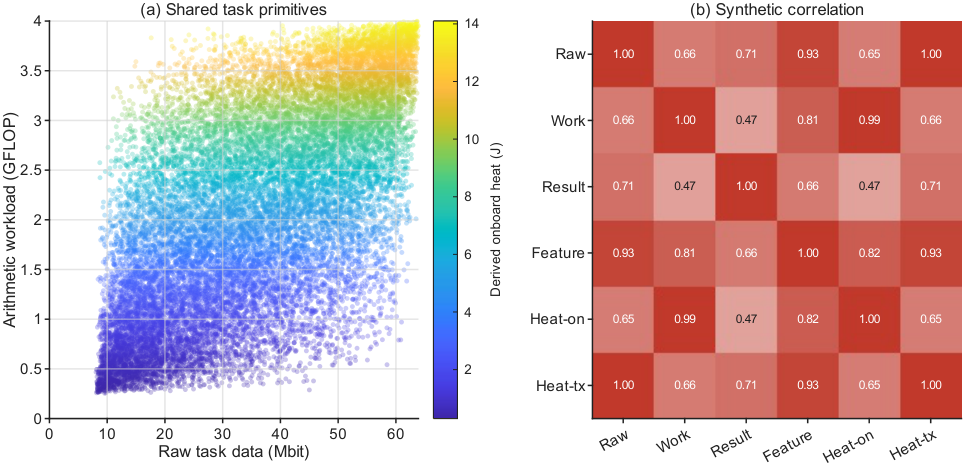

**中文图注：** 合成生成器内部一致性审计。完整双语图注见 PDF。

### F004 · 中心化全动作训练机制

**Source:** p.11

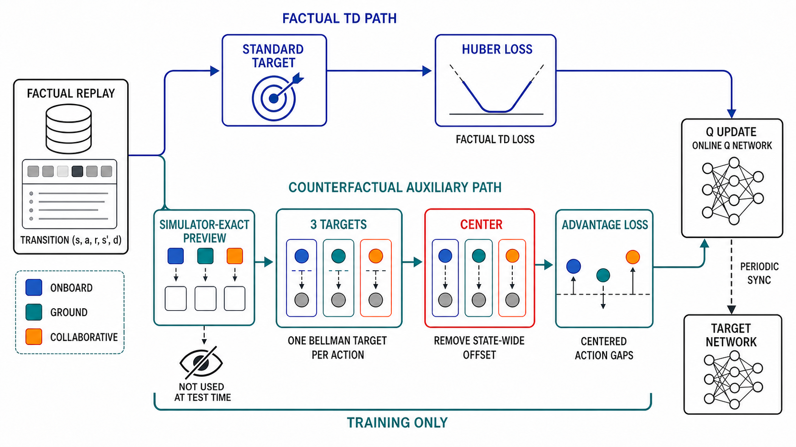

**中文图注：** 中心化全动作训练机制。完整双语图注见 PDF。

### F006 · 七工况性能

**Source:** p.18

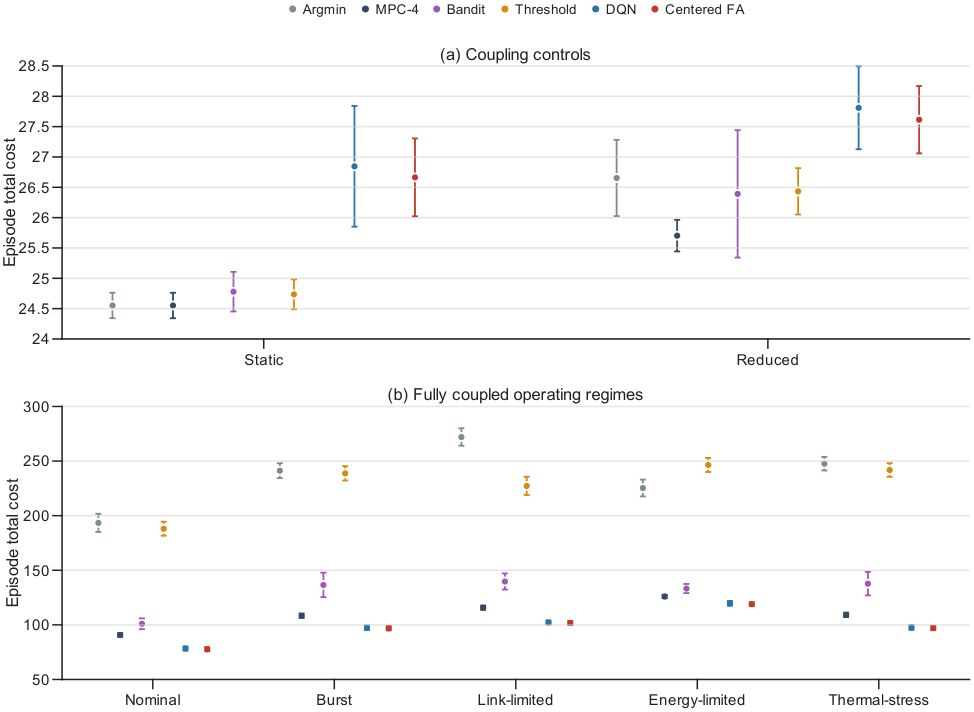

**中文图注：** 七工况性能。完整双语图注见 PDF。

### F007 · DQN 家族性能

**Source:** p.19

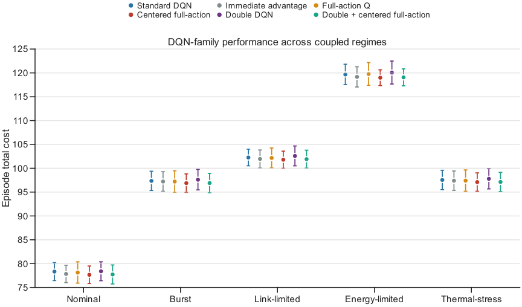

**中文图注：** DQN 家族性能。完整双语图注见 PDF。

### F008 · 代表性训练诊断

**Source:** p.22

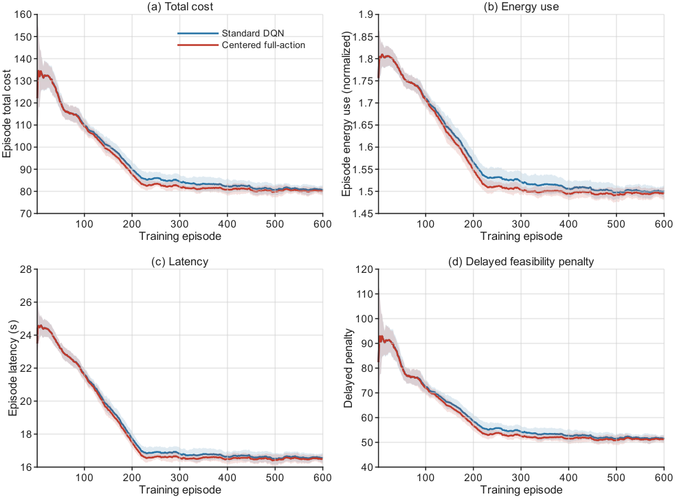

**中文图注：** 代表性训练诊断。完整双语图注见 PDF。

### F009 · 参数敏感性与规划边界

**Source:** p.23

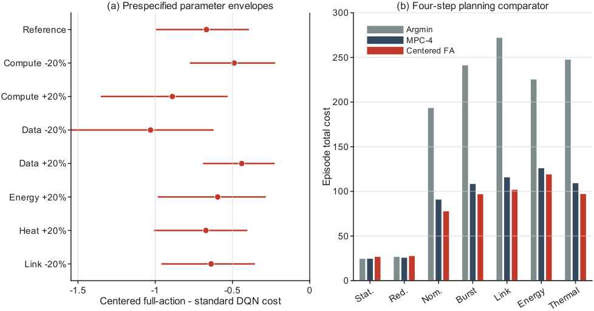

**中文图注：** 参数敏感性与规划边界。完整双语图注见 PDF。

### T001 · 与最接近方法家族的特征比较

**Source:** p.4

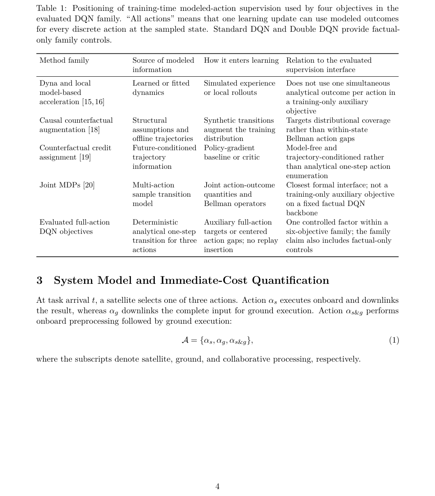

**中文表注：** 与最接近方法家族的特征比较。完整双语表注见 PDF。

### T002 · 15 维任务描述量字典

**Source:** p.6

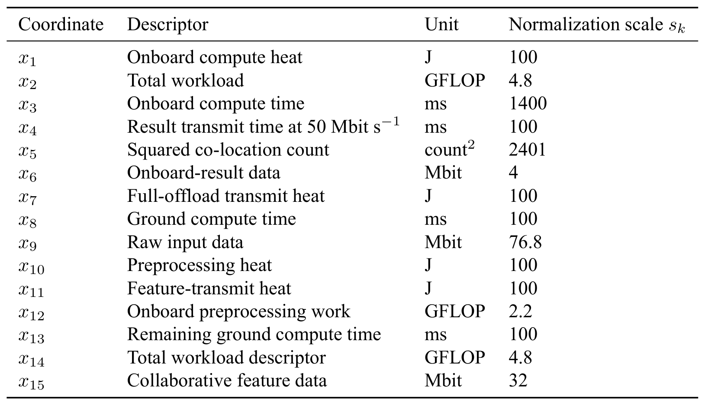

**中文表注：** 15 维任务描述量字典。完整双语表注见 PDF。

### T003 · 工程原语与依据

**Source:** p.7

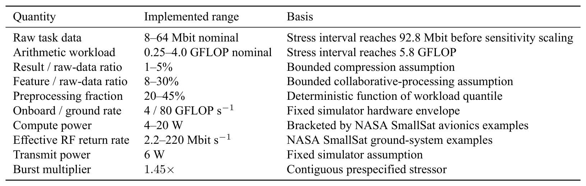

**中文表注：** 工程原语与依据。完整双语表注见 PDF。

### T004 · 七工况回合总成本

**Source:** p.17

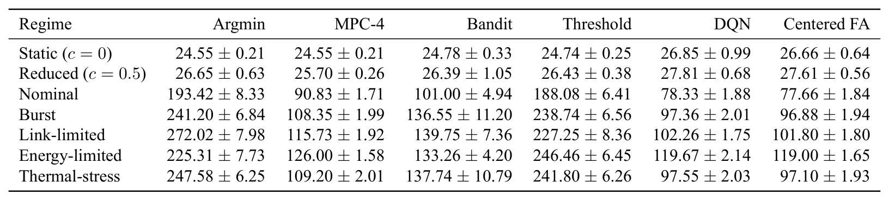

**中文表注：** 七工况回合总成本。完整双语表注见 PDF。

### T005 · DQN 家族相对 MPC-4 的联合推断

**Source:** p.19

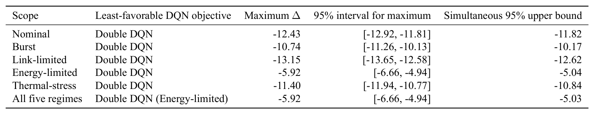

**中文表注：** DQN 家族相对 MPC-4 的联合推断。完整双语表注见 PDF。

### T006 · 六种 DQN 目标的性能

**Source:** p.19

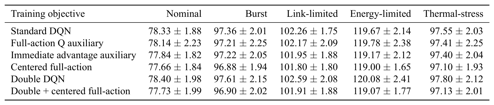

**中文表注：** 六种 DQN 目标的性能。完整双语表注见 PDF。

### T007 · 固定系数组件与主干比较

**Source:** p.20

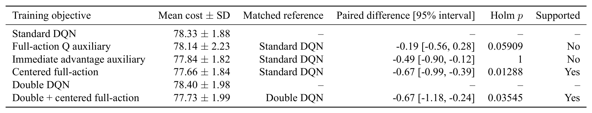

**中文表注：** 固定系数组件与主干比较。完整双语表注见 PDF。

### T008 · 中心化全动作相对标准 DQN 的配对推断

**Source:** p.20

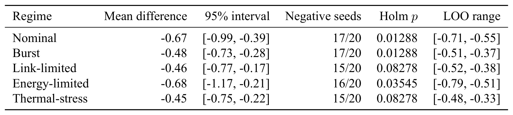

**中文表注：** 中心化全动作相对标准 DQN 的配对推断。完整双语表注见 PDF。

### T009 · 训练信息与计算量核算

**Source:** p.20

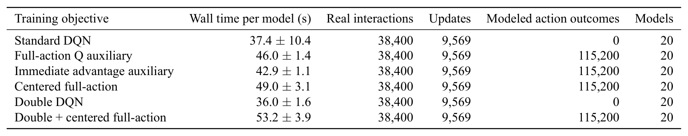

**中文表注：** 训练信息与计算量核算。完整双语表注见 PDF。

### T010 · 滚动时域规划深度

**Source:** p.21

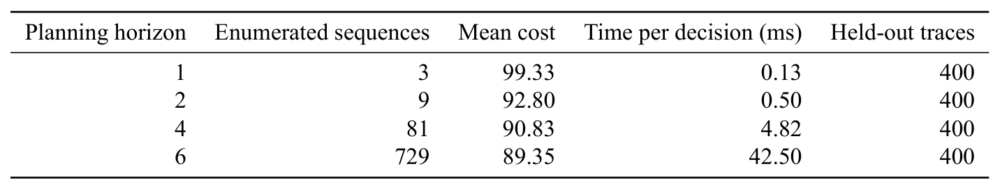

**中文表注：** 滚动时域规划深度。完整双语表注见 PDF。

### T011 · 标准 DQN 相对 MPC-4 的工程结果分解

**Source:** p.21

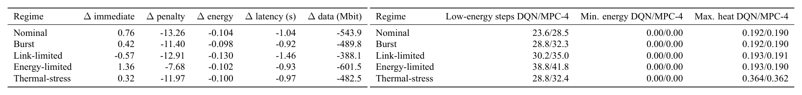

**中文表注：** 标准 DQN 相对 MPC-4 的工程结果分解。完整双语表注见 PDF。

### T012 · 预设参数敏感性

**Source:** p.23

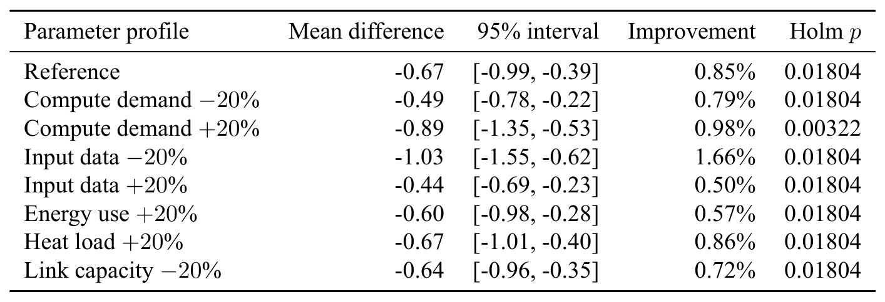

**中文表注：** 预设参数敏感性。完整双语表注见 PDF。

### T013 · 训练时预览误设

**Source:** p.24

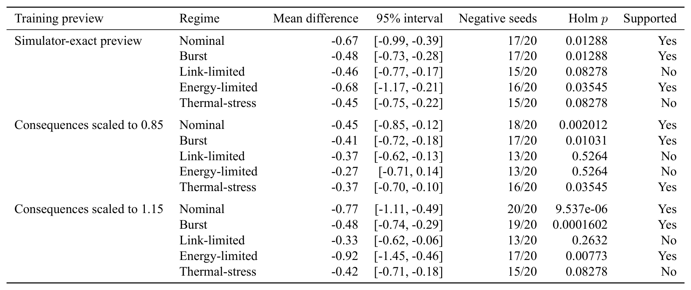

**中文表注：** 训练时预览误设。完整双语表注见 PDF。

## 阅读提示

核心证据为六种 DQN 目标相对 MPC-4 的 30 个配对比较；家族内部差异更小且依赖工况。工程解释受合成软约束基准限制，运行验证、机制分离和更强比较器均列入未来工作。
